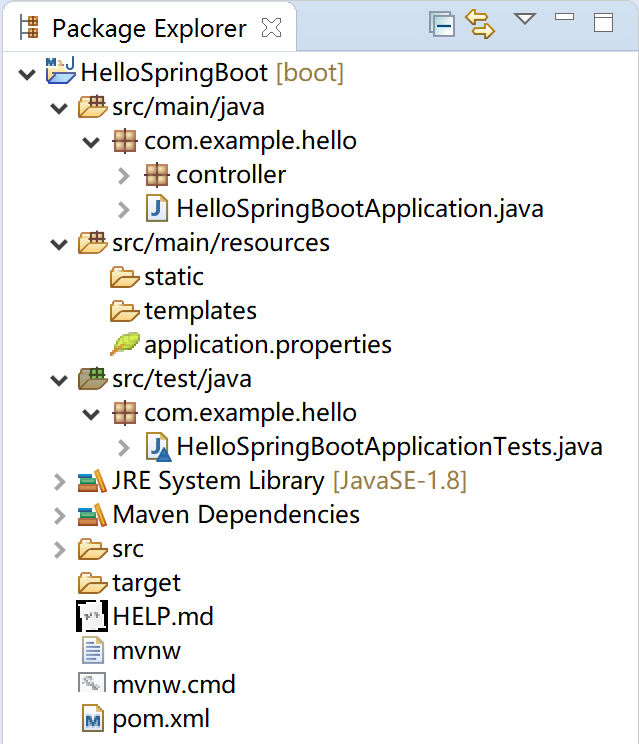

# 第3章 Spring Boot原理剖析

Spring Boot拥有很多的魔法，大部分基于这样一条原则“约定大于配置”：通过固定的目录结构和优先级，大大简化了程序的开发工作量。同时，Spring Boot也为“个性化”的项目或“个性化”的人提供了配置选项。对我们向客户交付软件产品而言，遵循Spring Boot的“约定”是明智之选。

Spring Boot的启动类和核心注解，是其“自动配置”的的基础。

本章，我们会从项目结构、启动类与核心注解和自动配置原理三个方面简要介绍Spring Boot的原理。需要进一步学习的同学，我推荐“**Spring Boot编程思想(核心篇)**”这本书，对在项目中针对Spring Boot框架扩展大有裨益。

## <span id = "structure">3.1 项目结构</span>

Spring官方为我们生成的项目，都具有固定的项目结构。下面，我们以上一章提供的“Hello Spring Boot”项目为例，来介绍Spring Boot的项目结构。



### 3.1.1 Maven配置文件

pom.xml文件，maven项目的配置依赖管理文件。其中包含了Spring Boot版本、各种starter和spring-boot-maven-plugin插件。

```xml
<?xml version="1.0" encoding="UTF-8"?>
<project xmlns="http://maven.apache.org/POM/4.0.0" xmlns:xsi="http://www.w3.org/2001/XMLSchema-instance"
	xsi:schemaLocation="http://maven.apache.org/POM/4.0.0 https://maven.apache.org/xsd/maven-4.0.0.xsd">
	<modelVersion>4.0.0</modelVersion>
	<parent>
		<groupId>org.springframework.boot</groupId>
		<artifactId>spring-boot-starter-parent</artifactId>
		<version>2.2.0.RELEASE</version>
		<relativePath/> <!-- lookup parent from repository -->
	</parent>
	<groupId>com.example</groupId>
	<artifactId>hello</artifactId>
	<version>0.0.1-SNAPSHOT</version>
	<name>HelloSpringBoot</name>
	<description>My First Spring Boot Project.</description>

	<properties>
		<java.version>1.8</java.version>
	</properties>

	<dependencies>
		<dependency>
			<groupId>org.springframework.boot</groupId>
			<artifactId>spring-boot-starter-web</artifactId>
		</dependency>

		<dependency>
			<groupId>org.springframework.boot</groupId>
			<artifactId>spring-boot-starter-test</artifactId>
			<scope>test</scope>
			<exclusions>
				<exclusion>
					<groupId>org.junit.vintage</groupId>
					<artifactId>junit-vintage-engine</artifactId>
				</exclusion>
			</exclusions>
		</dependency>
	</dependencies>

	<build>
		<plugins>
			<plugin>
				<groupId>org.springframework.boot</groupId>
				<artifactId>spring-boot-maven-plugin</artifactId>
			</plugin>
		</plugins>
	</build>

</project>
```

- spring-boot-starter-parent：是 Spring Boot的版本仲裁中心，其指定了Spring Boot的版本；
- starter启动器：Spring Boot的各种模块依赖，基于自动配置，为我们做了大量的配置依赖工作；
- spring-boot-maven-plugin插件： 能够以Maven的方式为应用提供Spring Boot的支持，即为Spring Boot应用提供了执行Maven操作的可能。 能够将Spring Boot应用打包为可执行的jar或war文件，然后以通常的方式运行Spring Boot应用。

这里特别说明一下spring-boot-maven-plugin提供的5个Maven Goals：

- spring-boot:repackage，默认goal。在mvn package之后，再次打包可执行的jar/war，同时保留mvn package生成的jar/war为.origin；
- spring-boot:run，运行Spring Boot应用；
- spring-boot:start，在mvn integration-test阶段，进行Spring Boot应用生命周期的管理；
- spring-boot:stop，在mvn integration-test阶段，进行Spring Boot应用生命周期的管理；
- spring-boot:build-info，生成Actuator使用的构建信息文件build-info.properties。

### 3.1.2 src/main/java

代码主目录，Spring  Boot的启动类就在这里。例如，`com.example.hello.HelloSpringBootApplication`。

启动类管理了其下的各个package的默认扫描，例如扫描其下package中的Controller。

根据项目开发规范，一般而言，其实体类(entity) 、数据访问类(Dao) 、服务类(Service) 、前端控制器(Controller) 、常量接口类(constant) 和一些工具类(utils) 都应该放置在这里。

### 3.1.3 src/main/resources

各种资源，如配置文件application.properties都应该防止在这里。如果你的程序使用了MyBatis，则其mapper文件也应该防止在这里的某个子目录下。

静态资源文件存放在static子目录中。如果你的Spring Boot应用是个前后端分离的项目，为了简化部署（只有一台服务器，服务用户人数在50人左右的简单应用），可以将前端vue的对应文件放置在这里，然后使用`java -jar xxx.jar`就可以运行这个程序了。

动态模板文件存放在templates子目录中。例如项目中的Thymeleaf 模板文件。

### 3.1.4 src/test/java

顾名思义，这里是单元测试代码的栖身之处。

## <span id = "baseConfig">3.2 基本配置</span>

## <span id = "annotation">3.3 启动类与核心注解</span>

## <span id = "autoConfig">3.4 自动配置原理</span>

## <span id = 'homework'>2.6 课后作业</span>

